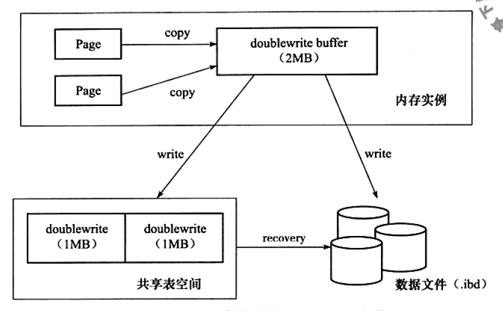

# Doublewrite Buffer

1. __Diagram__

2. __Definition__
    * The doublewrite(2MB) buffer is a storage area where InnoDB writes pages flushed from the buffer pool before writing the pages to their proper positions in the InnoDB data files.
      Doublewrite buffer will be persisted into share tablespace.
      If there is an operating system, storage subsystem, or unexpected mysqld process exit in the middle of a page write, InnoDB can find a good copy of the page from the doublewrite buffer during crash recovery.
    * Although data is written twice, the doublewrite buffer does not require twice as much I/O overhead or twice as many I/O operations.
      Data is written to the doublewrite buffer in a large sequential chunk, with a single fsync() call to the operating system.

3. __Why__
    * If there is an operating system, storage subsystem, or unexpected mysqld process exit in the middle of a page write.
      Say, we want to flush 16KB data to data page, but when 4KB finished, OS crashed. At this moment, data page is broken.
      Even if we have redo log, we cannot recovery this data page, due to it has been broken already, redo log cannot be applied.
      In this case, we can restore data page from doublewrite in share tablespace.