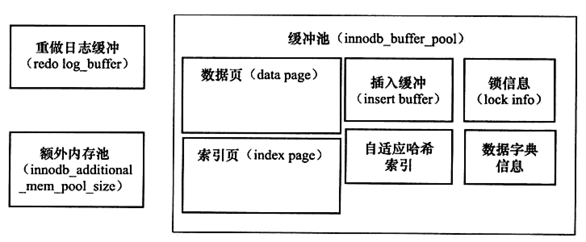

# Memory

1. __Diagram__

2. __Buffer Pool__
    * Data page
    * Index page
    * Change page (Insert Page, before 5.5)
    * Lock info
    * Data dictionary
    * Adaptive hash index

3. __Redo log buffer__. It will be triggered when:
    * Master thread flush every one mintus
    * Each commit
    * The rest of capacity of redo log buffer less that 1/2

4. __Additional_mem_pool_size__