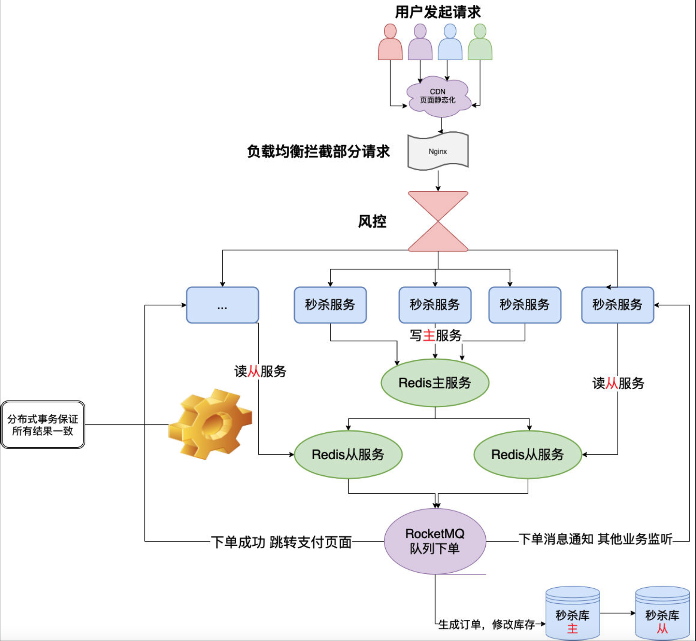

# Flash Sale System Design

1. __Problems__
* 高并发，短时间内会有大量用户访问。大量的请求进来，我们就要考虑缓存雪崩、缓存击穿、缓存穿透的问题。如果几十万请求直接落到数据库则会导致数据库宕机。
* 超卖。
* 链接暴露，导致可以使用秒杀脚本自动批量提交。
* 分布式事务，任何⼀步都是可能出错的，⽽且我们是在不同的服务⾥⾯出错的，那就涉及分布式事务了。

2. __Solution__
* 为秒杀建立单独的服务和数据库，这样即使数据库宕机也不会影响到其他服务。
* URL动态化，MD5加密，后端验证。
* Redis集群，主从同步，读写分离，开启持久化。
* 拦截恶意请求，单个用户请求过多的话，在网关进行拦截，不让其请求进入服务器。
* 页面静态资源放入CDN。
* 控制秒杀按钮，到特定时间才能点击，并且限制连续点击。
* 前后端限流。
* 库存预热，开始秒杀前将商品库存信息加载到redis中去，让整个流程都到redis里面去做。然后等秒杀结束后再去数据库修改数据库。
* 如果库存只剩下1个了，由于⾼并发，4个服务器⼀起查询了发现都是还有1个，那⼤家都觉得是⾃⼰抢到了，就都去扣库存，那结果就变成了-3，出现了超卖。写⼀个Lua脚本把判断库存扣减库存的操作都写在⼀个脚本丢给Redis去。Lua脚本是类似Redis事务，有⼀定的原⼦性，不会被其他命令插队，可以完成⼀些Redis事务性的操作
* 削峰填⾕，你可以把它放消息队列，然后⼀点点消费去改库存。
* 分布式事务要是认为⼀定要成功什么的那就不对了，对于秒杀来说⼏个请求丢了就丢了，要保证时效和服务的可⽤可靠。所以TCC和最终⼀致性其实不是很适合，TCC开发成本很⼤，所有接⼝都要写三次，因为涉及TCC的三个阶段。最终⼀致性基本上都是靠轮训的操作去保证⼀个操作⼀定成功，那时效性就⼤打折扣了。不那么可靠的两段式（2PC）和三段式（3PC）就派上⽤场了，他们不⼀定能保证数据最终⼀致，但是效率上还算ok。

3. __Architecture__
